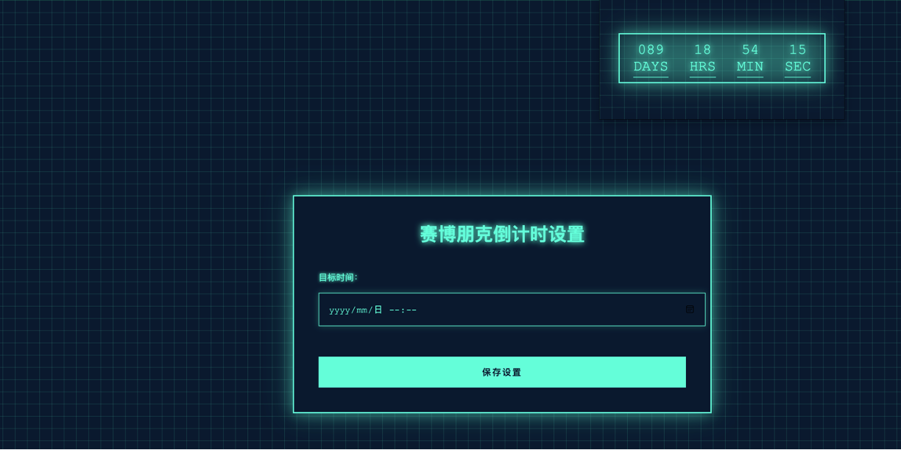

# 🕒 Cyber Countdown


一个具有赛博朋克风格的 Chrome 倒计时插件。无论是在学习、工作还是等待重要时刻，这款插件都能以独特的视觉风格帮助您追踪时间。

## ✨ 特性

- 🎯 实时倒计时显示（天、时、分、秒）
- 🔧 支持自定义目标时间
- 📊 工具栏图标显示剩余天数
- 🎨 赛博朋克风格界面
- 🚀 即开即用，无需配置
- 📅 可视化日期时间选择器
- 💾 自动保存设置

## 📸 截图



## 🚀 安装步骤

1. 克隆仓库到本地：
   ```bash
   git clone https://github.com/zhiwu2006/CyberCountdown.git
   ```

2. 在 Chrome 浏览器中安装：
   - 打开 Chrome 浏览器
   - 在地址栏输入 `chrome://extensions/`
   - 打开右上角的"开发者模式"
   - 点击左上角的"加载已解压的扩展程序"
   - 选择克隆下来的文件夹

## 🎮 使用方法

1. 在 Chrome 工具栏中找到插件图标
2. 图标上会显示剩余天数
3. 点击图标查看详细倒计时
4. 设置目标时间：
   - 在地址栏输入：`chrome://extensions`
   - 找到 Cyber Countdown
   - 点击"扩展程序选项"
   - 使用日历选择器设置目标时间

## 🔧 技术栈

- HTML5
- CSS3 (动画和现代布局)
- JavaScript (ES6+)
- Chrome Extensions API
- Flatpickr (日期时间选择器)

## 📁 项目结构

```
CyberCountdown/
├── manifest.json     # 插件配置文件
├── popup.html       # 弹出窗口界面
├── popup.js        # 弹出窗口逻辑
├── options.html    # 设置页面
├── background.js   # 后台服务
├── icon.png        # 插件图标
└── README.md       # 项目文档
```

## 🤝 贡献

欢迎提交 Issue 和 Pull Request！

## 📝 开源协议

本项目采用 [MIT 许可证](LICENSE)。

## 🙋‍♂️ 作者

- [@zhiwu2006](https://github.com/zhiwu2006)

## 🌟 致谢

感谢所有为这个项目提供反馈和建议的用户。
